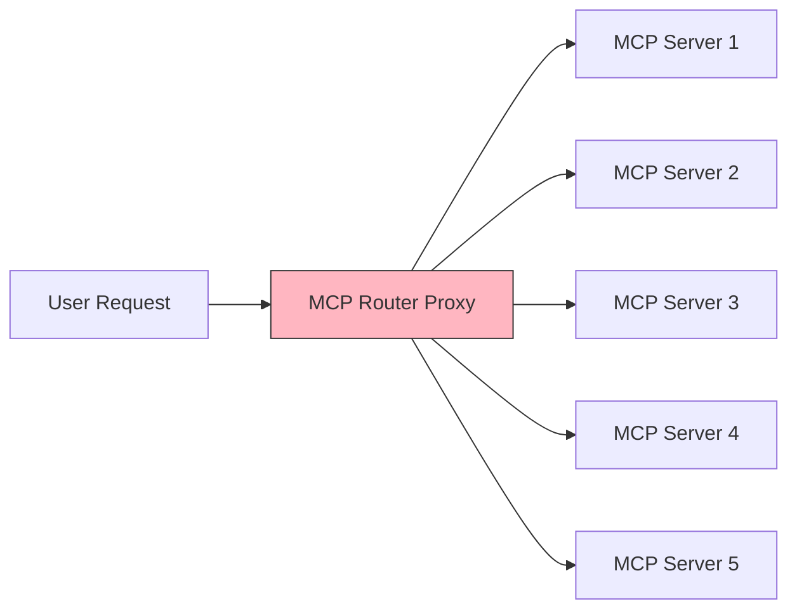

## DeepNLP OneKey MCP Router to Access Commercial MCP servers | MCPs AI Agent Revenue Sharing Initiative

OneKey MCP Router is an proxy MCP servers supports streaming http services and help authenticate various commercial or non-commercial MCPs using **one single** access key for MCPs.
Calling MCPs or AI Agent APIs by the credit system will reduce the costs of plans (Google Maps/Google Search/Other Web Search services/Financial Data) by a large margin and gain discount.
See the list of supported MCPs at [Doc](https://www.deepnlp.org/doc/onekey_mcp_router)

**Features**
1. Use just one key to access commercial and non-Commercial MCP servers via Proxy Router for free tier and discounted rates, without needs to registered one keys at a time.
2. OneKey Authentication of various MCP or AI Agent service provides
3. Revenue Sharing Initiative : Support MCP APIs and AI Agents Moneytization By Credit System




Source Code of MCP OneKey Proxy Server visit Github (https://github.com/aiagenta2z/mcp-marketplace)

## 1. Quick Start
Here's how to get started based on your preferred client or environment.

### Cursor/VS Code/(MCP Server Client) Users

**Register & Get Your Key**: Register and generate your DEEPNLP_ONEKEY_ROUTER_ACCESS key for the scene 'DEEPNLP_ONEKEY_ROUTER' at [OneKey Key Generation](https://www.deepnlp.org/workspace/keys).

**Configure Your Client**: Set up your client's mcp.config file using the configuration format provided in the [Open MCP Marketplace](https://www.deepnlp.org/store/ai-agent/mcp-server). This replaces the need for individual API keys for each MCP.

**Example Configuration**: (Google Maps): The original MCP configuration requires a Maps_API_KEY.

**Usage and Beta Test**  
Now we are in beta testing mode, you can use below beta test keys for beta testing in your Clients.

Change `server_name` to other MCP servers.

```
export DEEPNLP_ONEKEY_ROUTER_ACCESS=BETA_TEST_KEY_OCT_2025 
```

```
{
    "mcpServers":{
        "deepnlp-onekey-my-server": {
            "url": "https://agent.deepnlp.org/mcp?server_name={server_name}&onekey={DEEPNLP_ONEKEY_ROUTER_ACCESS}"
        }
    }
}
```

Google Maps MCP Config Demo

```
{
    "mcpServers":{
        "deepnlp-onekey-google-maps": {
            "url": "https://agent.deepnlp.org/mcp?server_name=google-maps&onekey=BETA_TEST_KEY_OCT_2025"
        }
    }
}
```


### ChatGPT/Claude Web Users

In the developer mode, choose add Agent/Tools and copy paste the MCP Server URL in the Doc

```  
https://agent.deepnlp.org/mcp?server_name=google-maps&onekey=BETA_TEST_KEY_OCT_2025
```

### Python/NodeJS Users

If you are running programmably of the onekey mcp router APIs, you can call 
each mcp by `tools_list` and `tools_call` function to get the results.

This is a simple example of using python client to call `google-maps` mcp to get_maps_direction from maps_direction from 'Boston' to 'New York' driving
For complete list of MCPs and server_name, refer the docs: https://www.deepnlp.org/doc/onekey_mcp_router

```
def run_mcp_router_api_example():
    """
        # 1. This Function Connects to Google-Maps MCPs and run maps_direction from 'Boston' to 'New York' via driving
        # 2. Complete List of Supported Tools Use Check : https://www.deepnlp.org/doc/onekey_mcp_router
    """

    from mcp_marketplace import OneKeyMCPRouter
    
    example = {"server_name":"google-maps","tool_name":"maps_directions","tool_input":{"destination":"New York","mode":"driving","origin":"Boston"}}
    server_name = example.get("server_name", "")

    ## 1. MCP Initialize POST Request
    ONEKEY_BETA = "BETA_TEST_KEY_OCT_2025"
    router = OneKeyMCPRouter(server_name=server_name, onekey=ONEKEY_BETA)

    ## 2. Check Available Tools, tools/list
    available_tools = router.tools_list(server_name)
    print (f"Server {server_name}|available_tools {available_tools}")

    ## Your LLM Code

    ## 3. Run Tool, Post tools/call request
    result_json = router.tools_call(server_name, example.get("tool_name", ""), example.get("tool_input", {}))
    print (f"Server {server_name}|tool_name {example.get("tool_name", "")} | tool_input {example.get("tool_input", {})} |result_json {result_json}")

```

Result

```
Server google-maps|available_tools {'result': {'tools': [{'name': 'maps_geocode', 'description': 'Convert an address into geographic coordinates', 'inputSchema': {'type': 'object', 'properties': {'address': {'type': 'string', 'description': 'The address to geocode'}}, 'required': ['address']}}, {'name': 'maps_reverse_geocode', 'description': 'Convert coordinates into an address', 'inputSchema': {'type': 'object', 'properties': {'latitude': {'type': 'number', 'description': 'Latitude coordinate'}, 'longitude': {'type': 'number', 'description': 'Longitude coordinate'}}, 'required': ['latitude', 'longitude']}}, {'name': 'maps_search_places', 'description': 'Search for places using Google Places API', 'inputSchema': {'type': 'object', 'properties': {'query': {'type': 'string', 'description': 'Search query'}, 'location': {'type': 'object', 'properties': {'latitude': {'type': 'number'}, 'longitude': {'type': 'number'}}, 'description': 'Optional center point for the search'}, 'radius': {'type': 'number', 'description': 'Search radius in meters (max 50000)'}}, 'required': ['query']}}, {'name': 'maps_place_details', 'description': 'Get detailed information about a specific place', 'inputSchema': {'type': 'object', 'properties': {'place_id': {'type': 'string', 'description': 'The place ID to get details for'}}, 'required': ['place_id']}}, {'name': 'maps_distance_matrix', 'description': 'Calculate travel distance and time for multiple origins and destinations', 'inputSchema': {'type': 'object', 'properties': {'origins': {'type': 'array', 'items': {'type': 'string'}, 'description': 'Array of origin addresses or coordinates'}, 'destinations': {'type': 'array', 'items': {'type': 'string'}, 'description': 'Array of destination addresses or coordinates'}, 'mode': {'type': 'string', 'description': 'Travel mode (driving, walking, bicycling, transit)', 'enum': ['driving', 'walking', 'bicycling', 'transit']}}, 'required': ['origins', 'destinations']}}, {'name': 'maps_elevation', 'description': 'Get elevation data for locations on the earth', 'inputSchema': {'type': 'object', 'properties': {'locations': {'type': 'array', 'items': {'type': 'object', 'properties': {'latitude': {'type': 'number'}, 'longitude': {'type': 'number'}}, 'required': ['latitude', 'longitude']}, 'description': 'Array of locations to get elevation for'}}, 'required': ['locations']}}, {'name': 'maps_directions', 'description': 'Get directions between two points', 'inputSchema': {'type': 'object', 'properties': {'origin': {'type': 'string', 'description': 'Starting point address or coordinates'}, 'destination': {'type': 'string', 'description': 'Ending point address or coordinates'}, 'mode': {'type': 'string', 'description': 'Travel mode (driving, walking, bicycling, transit)', 'enum': ['driving', 'walking', 'bicycling', 'transit']}}, 'required': ['origin', 'destination']}}]}, 'jsonrpc': '2.0', 'id': '2'}
Server google-maps|tool_name maps_directions | tool_input {'destination': 'New York', 'mode': 'driving', 'origin': 'Boston'} |result_json {'jsonrpc': '2.0', 'result': {'success': True, 'content': [{'type': 'text', 'text': '{\n  "routes": [\n    {\n      "summary": "I-90 W",\n      "distance": {\n        "text": "214 mi",\n        "value": 344980\n      },\n      "duration": {\n        "text": "3 hours 45 mins",\n        "value": 13480\n      },\n      "steps": [\n        {\n          "instructions": "Head <b>north</b> on <b>Federal St</b> toward <b>Milk St</b>",\n          "distance": {\n            "text": "469 ft",\n            "value": 143\n          },\n          "duration": {\n            "text": "1 min",\n            "value": 47\n          },\n          "travel_mode": "DRIVING"\n        },\n        {\n          "instructions": "Turn <b>right</b> onto <b>Milk St</b>",\n          "distance": {\n            "text": "118 ft",\n            "value": 36\n          },\n          "duration": {\n            "text": "1 min",\n            "value": 18\n          },\n          "travel_mode": "DRIVING"\n        },\n        {\n          "instructions": "Turn <b>right</b> at the 1st cross street onto <b>Congress St</b>",\n          "distance": {\n            "text": "0.2 mi",\n            "value": 355\n          },\n          "duration": {\n            "text": "1 min",\n            "value": 79\n          },\n          "travel_mode": "DRIVING"\n        },\n        {\n          "instructions": "Turn <b>right</b> onto <b>Purchase St</b>",\n          "distance": {\n            "text": "89 ft",\n            "value": 27\n          },\n          "duration": {\n            "text": "1 min",\n            "value": 6\n          },\n          "travel_mode": "DRIVING"\n        },\n        {\n          "instructions": "Take the <b>I-93 S</b> ramp on the <b>left</b> to <b>I-90 W</b>/<wbr/><b>Quincy</b>/<wbr/><b>Worcester</b>",\n          "distance": {\n            "text": "0.5 mi",\n            "value": 749\n          },\n          "duration": {\n            "text": "1 min",\n            "value": 62\n          },\n          "travel_mode": "DRIVING"\n        },\n        {\n          "instructions": "Take the <b>I-90 W</b> ramp",\n          "distance": {\n            "text": "0.1 mi",\n            "value": 189\n          },\n          "duration": {\n            "text": "1 min",\n            "value": 12\n          },\n          "travel_mode": "DRIVING"\n        },\n        {\n          "instructions": "Take the <b>Route 90 W</b> ramp to <b>Masspike</b>/<wbr/><b>Worcester</b>",\n          "distance": {\n            "text": "0.2 mi",\n            "value": 307\n          },\n          "duration": {\n            "text": "1 min",\n            "value": 20\n          },\n          "travel_mode": "DRIVING"\n        },\n        {\n          "instructions": "Merge onto <b>I-90 W</b><div style=\\"font-size:0.9em\\">Toll road</div>",\n          "distance": {\n            "text": "55.2 mi",\n            "value": 88825\n          },\n          "duration": {\n            "text": "53 mins",\n            "value": 3154\n          },\n          "travel_mode": "DRIVING"\n        },\n        {\n          "instructions": "Take exit <b>78</b> for <b>I-84</b> toward <b>Hartford Connecticut</b>/<wbr/><b>N.Y.City</b><div style=\\"font-size:0.9em\\">Toll road</div>",\n          "distance": {\n            "text": "0.7 mi",\n            "value": 1139\n          },\n          "duration": {\n            "text": "1 min",\n            "value": 49\n          },\n          "travel_mode": "DRIVING"\n        },\n        {\n          "instructions": "Continue onto <b>I-84</b><div style=\\"font-size:0.9em\\">Toll road</div><div style=\\"font-size:0.9em\\">Entering Connecticut</div>",\n          "distance": {\n            "text": "40.9 mi",\n            "value": 65866\n          },\n          "duration": {\n            "text": "36 mins",\n            "value": 2141\n          },\n          "travel_mode": "DRIVING"\n        },\n        {\n          "instructions": "Take exit <b>57</b> on the <b>left</b> for <b>CT-15 S</b> toward <b>I-91 S</b>/<wbr/><b>Charter Oak Bridge</b>/<wbr/><b>N.Y.City</b>",\n          "distance": {\n            "text": "0.6 mi",\n            "value": 899\n          },\n          "duration": {\n            "text": "1 min",\n            "value": 32\n          },\n          "travel_mode": "DRIVING"\n        },\n        {\n          "instructions": "Continue onto <b>CT-15 S</b>",\n          "distance": {\n            "text": "0.5 mi",\n            "value": 874\n          },\n          "duration": {\n            "text": "1 min",\n            "value": 32\n          },\n          "travel_mode": "DRIVING"\n        },\n        {\n          "instructions": "Continue onto <b>CT-15 S</b>/<wbr/><b>US-5 S</b>",\n          "distance": {\n            "text": "0.8 mi",\n            "value": 1310\n          },\n          "duration": {\n            "text": "1 min",\n            "value": 50\n          },\n          "travel_mode": "DRIVING"\n        },\n        {\n          "instructions": "Take the exit onto <b>I-91 S</b>",\n          "distance": {\n            "text": "17.1 mi",\n            "value": 27465\n          },\n          "duration": {\n            "text": "15 mins",\n            "value": 928\n          },\n          "travel_mode": "DRIVING"\n        },\n        {\n          "instructions": "Take exit <b>17</b> to merge onto <b>CT-15 S</b>",\n          "distance": {\n            "text": "30.2 mi",\n            "value": 48619\n          },\n          "duration": {\n            "text": "28 mins",\n            "value": 1699\n          },\n          "travel_mode": "DRIVING"\n        },\n        {\n          "instructions": "Take exit <b>34</b> for <b>State Rte 8 S</b>/<wbr/><b>State Rte 108</b> toward <b>Bridgeport</b>",\n          "distance": {\n            "text": "0.6 mi",\n            "value": 1033\n          },\n          "duration": {\n            "text": "1 min",\n            "value": 48\n          },\n          "travel_mode": "DRIVING"\n        },\n        {\n          "instructions": "Merge onto <b>CT-8 S</b>/<wbr/><b>State Rte 8 S</b> via the ramp to <b>Bridgeport</b>",\n          "distance": {\n            "text": "5.3 mi",\n            "value": 8493\n          },\n          "duration": {\n            "text": "5 mins",\n            "value": 313\n          },\n          "travel_mode": "DRIVING"\n        },\n        {\n          "instructions": "Take exit <b>1B</b> to merge onto <b>I-95 S</b> toward <b>N.Y. City</b><div style=\\"font-size:0.9em\\">Entering New York</div>",\n          "distance": {\n            "text": "45.2 mi",\n            "value": 72822\n          },\n          "duration": {\n            "text": "49 mins",\n            "value": 2936\n          },\n          "travel_mode": "DRIVING"\n        },\n        {\n          "instructions": "Keep <b>right</b> to stay on <b>I-95 S</b>, follow signs for <b>Triboro Brg</b>/<wbr/><b>Geo Washington Brg</b>",\n          "distance": {\n            "text": "0.6 mi",\n            "value": 1001\n          },\n          "duration": {\n            "text": "1 min",\n            "value": 45\n          },\n          "travel_mode": "DRIVING"\n        },\n        {\n          "instructions": "Keep <b>left</b> to continue on <b>I-278 W</b>, follow signs for <b>Robert F. Kennedy Brg</b>/<wbr/><b>Manhattan</b>",\n          "distance": {\n            "text": "4.7 mi",\n            "value": 7618\n          },\n          "duration": {\n            "text": "6 mins",\n            "value": 370\n          },\n          "travel_mode": "DRIVING"\n        },\n        {\n          "instructions": "Keep <b>left</b> to stay on <b>I-278 W</b>, follow signs for <b>Triboro Br</b>/<wbr/><b>Manhattan</b>/<wbr/><b>Queens</b><div style=\\"font-size:0.9em\\">Toll road</div>",\n          "distance": {\n            "text": "0.7 mi",\n            "value": 1066\n          },\n          "duration": {\n            "text": "1 min",\n            "value": 68\n          },\n          "travel_mode": "DRIVING"\n        },\n        {\n          "instructions": "Take exit <b>46</b> toward <b>Manhattan</b><div style=\\"font-size:0.9em\\">Toll road</div>",\n          "distance": {\n            "text": "0.2 mi",\n            "value": 262\n          },\n          "duration": {\n            "text": "1 min",\n            "value": 18\n          },\n          "travel_mode": "DRIVING"\n        },\n        {\n          "instructions": "Merge onto <b>Robert F. Kennedy Brg</b><div style=\\"font-size:0.9em\\">Toll road</div>",\n          "distance": {\n            "text": "0.4 mi",\n            "value": 670\n          },\n          "duration": {\n            "text": "1 min",\n            "value": 44\n          },\n          "travel_mode": "DRIVING"\n        },\n        {\n          "instructions": "Take the <b>FDR Dr S</b> exit<div style=\\"font-size:0.9em\\">Toll road</div>",\n          "distance": {\n            "text": "0.4 mi",\n            "value": 668\n          },\n          "duration": {\n            "text": "1 min",\n            "value": 48\n          },\n          "travel_mode": "DRIVING"\n        },\n        {\n          "instructions": "Continue onto <b>FDR Dr</b>",\n          "distance": {\n            "text": "7.9 mi",\n            "value": 12792\n          },\n          "duration": {\n            "text": "13 mins",\n            "value": 776\n          },\n          "travel_mode": "DRIVING"\n        },\n        {\n          "instructions": "Take exit <b>2</b> toward <b>Manhattan Civic Ctr</b><div style=\\"font-size:0.9em\\">Toll road</div>",\n          "distance": {\n            "text": "0.1 mi",\n            "value": 237\n          },\n          "duration": {\n            "text": "1 min",\n            "value": 24\n          },\n          "travel_mode": "DRIVING"\n        },\n        {\n          "instructions": "Merge onto <b>Robert F. Wagner Sr. Pl</b>",\n          "distance": {\n            "text": "256 ft",\n            "value": 78\n          },\n          "duration": {\n            "text": "1 min",\n            "value": 22\n          },\n          "travel_mode": "DRIVING"\n        },\n        {\n          "instructions": "Turn <b>right</b> onto <b>Pearl St</b><div style=\\"font-size:0.9em\\">Toll road</div>",\n          "distance": {\n            "text": "351 ft",\n            "value": 107\n          },\n          "duration": {\n            "text": "1 min",\n            "value": 34\n          },\n          "travel_mode": "DRIVING"\n        },\n        {\n          "instructions": "Continue onto <b>St James Pl</b>",\n          "distance": {\n            "text": "0.2 mi",\n            "value": 313\n          },\n          "duration": {\n            "text": "2 mins",\n            "value": 108\n          },\n          "travel_mode": "DRIVING"\n        },\n        {\n          "instructions": "Turn <b>left</b> onto <b>Worth St</b>",\n          "distance": {\n            "text": "0.3 mi",\n            "value": 484\n          },\n          "duration": {\n            "text": "2 mins",\n            "value": 142\n          },\n          "travel_mode": "DRIVING"\n        },\n        {\n          "instructions": "Turn <b>left</b> onto <b>Federal Plaza</b>/<wbr/><b>Lafayette St</b><div style=\\"font-size:0.9em\\">Continue to follow Lafayette St</div>",\n          "distance": {\n            "text": "0.1 mi",\n            "value": 223\n          },\n          "duration": {\n            "text": "1 min",\n            "value": 59\n          },\n          "travel_mode": "DRIVING"\n        },\n        {\n          "instructions": "Continue onto <b>Centre St</b>",\n          "distance": {\n            "text": "0.1 mi",\n            "value": 229\n          },\n          "duration": {\n            "text": "1 min",\n            "value": 79\n          },\n          "travel_mode": "DRIVING"\n        },\n        {\n          "instructions": "Merge onto <b>Park Row</b>",\n          "distance": {\n            "text": "66 ft",\n            "value": 20\n          },\n          "duration": {\n            "text": "1 min",\n            "value": 5\n          },\n          "travel_mode": "DRIVING"\n        },\n        {\n          "instructions": "Turn <b>right</b><div style=\\"font-size:0.9em\\">Partial restricted usage road</div>",\n          "distance": {\n            "text": "200 ft",\n            "value": 61\n          },\n          "duration": {\n            "text": "1 min",\n            "value": 12\n          },\n          "travel_mode": "DRIVING"\n        }\n      ]\n    }\n  ]\n}'}]}, 'id': '4'}

```


## 2. List of MCP Servers Requires Keys Supported By OneKey MCP Router

## Beta Test OneKey Router Keys
```
export DEEPNLP_ONEKEY_ROUTER_ACCESS=BETA_TEST_KEY_OCT_2025 
```

## List of MCP Router URL for Other MCP Configuration

| Category         | MCP Server        | Config                                                                                                                                  | Config Http URL                                                                                          | Web Demo Playground                                                                                                                     |
|------------------|-------------------|-----------------------------------------------------------------------------------------------------------------------------------------|----------------------------------------------------------------------------------------------------------|-----------------------------------------------------------------------------------------------------------------------------------------| 
| Maps             | Google Maps       | [Google Map OneKey Config](https://www.deepnlp.org/store/mcp-server/map/pub-google-maps/google-maps)                                    | https://agent.deepnlp.org/mcp?server_name=google-maps&onekey={DEEPNLP_ONEKEY_ROUTER_ACCESS}              | [Web Demo](https://agent.deepnlp.org/agent/mcp_tool_use?server=google-maps/google-maps)                                                 |
| Maps             | AMap (Gaode) Maps | [Amap OneKey Config](https://www.deepnlp.org/store/mcp-server/map/pub-amap-mcp/amap-mcp-%E9%AB%98%E5%BE%B7%E5%9C%B0%E5%9B%BE-mcp)       | https://agent.deepnlp.org/mcp?server_name=amap-maps-streamableHTTP&onekey={DEEPNLP_ONEKEY_ROUTER_ACCESS} | [Web Demo](https://agent.deepnlp.org/agent/mcp_tool_use?server=amap-mcp/amap-mcp-%E9%AB%98%E5%BE%B7%E5%9C%B0%E5%9B%BE-mcp)              |
| Maps             | Baidu Maps        | [Baidu Maps OneKey Config](https://www.deepnlp.org/store/mcp-server/map/pub-amap-mcp/amap-mcp-%E9%AB%98%E5%BE%B7%E5%9C%B0%E5%9B%BE-mcp) | https://agent.deepnlp.org/mcp?server_name=baidu-maps-sse&onekey={DEEPNLP_ONEKEY_ROUTER_ACCESS}           | [Web Demo](https://agent.deepnlp.org/agent/mcp_tool_use?server=baidu-map/baidu-map-mcp-%E7%99%BE%E5%BA%A6%E5%9C%B0%E5%9B%BE-mcp-server) |
| Google Search    | Google Search MCP | -                                                                                                                                       | -                                                                                                        | -                                                                                                                                       |
| Web Search       | Tavily AI Search  | [Tavily OneKey MCP Config](https://www.deepnlp.org/store/mcp-server/mcp-server/pub-tavily-ai/tavily-mcp)                                | https://agent.deepnlp.org/mcp?server_name=tavily-remote-mcp&onekey={DEEPNLP_ONEKEY_ROUTER_ACCESS}        | [Web Demo](https://agent.deepnlp.org/agent/mcp_tool_use?server=tavily-ai/tavily-mcp)                                                    |
| Web Search       | Firecrawl mcp     | [Firecrawl OneKey MCP Config](https://www.deepnlp.org/store/mcp-server/mcp-server/pub-mendableai/firecrawl-mcp-server)                  | https://agent.deepnlp.org/mcp?server_name=firecrawl-mcp&onekey={DEEPNLP_ONEKEY_ROUTER_ACCESS}            | [Web Demo](https://agent.deepnlp.org/agent/mcp_tool_use?server=mendableai/firecrawl-mcp-server)                                         |
| Web Search       | Perplexity Search | [Perplexity OneKey MCP Config](https://www.deepnlp.org/store/mcp-server/mcp-server/pub-perplexityai/modelcontextprotocol)               | https://agent.deepnlp.org/mcp?server_name=perplexity&onekey={DEEPNLP_ONEKEY_ROUTER_ACCESS}               | [Web Demo](https://agent.deepnlp.org/agent/mcp_tool_use?server=perplexityai/modelcontextprotocol)                                       |
| Web Search       | Brave Search      | [Brave Search OneKey MCP Config](https://www.deepnlp.org/store/mcp-server/web/pub-brave-search/brave-search)                            | https://agent.deepnlp.org/mcp?server_name=brave-search&onekey={DEEPNLP_ONEKEY_ROUTER_ACCESS}             | [Web Demo](https://agent.deepnlp.org/agent/mcp_tool_use?server=brave-search/brave-search)                                               |
| Web Search       | Search1API        | [Search1API OneKey MCP Config](https://deepnlp.org/store/mcp-server/mcp-server/pub-search1api/search1api)                               | https://agent.deepnlp.org/mcp?server_name=search1api&onekey={DEEPNLP_ONEKEY_ROUTER_ACCESS}               | [Web Demo](https://agent.deepnlp.org/agent/mcp_tool_use?server=search1api/search1api)                                                   |
| Web Image Search | Bing Image Search | [Bing Image Search OneKey MCP Config](https://www.deepnlp.org/store/ai-agent/mcp-server/pub-ai-hub-admin/bing-image-search-mcp)         | https://agent.deepnlp.org/mcp?server_name=bing-image-search-mcp&onekey={DEEPNLP_ONEKEY_ROUTER_ACCESS}    | [Web Demo](https://agent.deepnlp.org/agent/mcp_tool_use?server=ai-hub-admin/bing-image-search-mcp)                                      |
| Design | Figma(Official)   | [Figma OneKey MCP Config](https://www.deepnlp.org/store/ai-agent/ai-agent/pub-figma/mcp-server-guide)                         | https://agent.deepnlp.org/mcp?server_name=figma&onekey={DEEPNLP_ONEKEY_ROUTER_ACCESS}                    | [Web Demo](https://agent.deepnlp.org/agent/mcp_tool_use?server=figma/mcp-server-guide)                                                 |
| Design           | Figma Context MCP | [Figma Context OneKey MCP Config](https://www.deepnlp.org/store/ai-agent/ai-agent/pub-GLips/figma-context-mcp)                          | https://agent.deepnlp.org/mcp?server_name=figma-context&onekey={DEEPNLP_ONEKEY_ROUTER_ACCESS}                   | [Web Demo](https://agent.deepnlp.org/agent/mcp_tool_use?server=GLips/figma-context-mcp)                                                 |
| Design           | AntV Chart MCP    | [AntV Chart MCP Config](https://www.deepnlp.org/store/mcp-server/mcp-server/pub-antvis/mcp-server-chart)                                | https://agent.deepnlp.org/mcp?server_name=mcp-server-chart&onekey={DEEPNLP_ONEKEY_ROUTER_ACCESS}         | [Web Demo](https://agent.deepnlp.org/agent/mcp_tool_use?server=antvis/mcp-server-chart)                                                 |
| Office Document  | Excel MCP Server  | [Excel MCP Server Config](https://www.deepnlp.org/store/ai-agent/ai-agent/pub-haris-musa/excel-mcp-server)                              | https://agent.deepnlp.org/mcp?server_name=excel&onekey={DEEPNLP_ONEKEY_ROUTER_ACCESS}                    | [Web Demo](https://agent.deepnlp.org/agent/mcp_tool_use?server=haris-musa/excel-mcp-server)                                             |
| Office Doc       | Notion MCP Server | [NotionAPI MCP Server Config](https://www.deepnlp.org/store/ai-agent/ai-agent/pub-makenotion/notion-mcp-server)                         | https://agent.deepnlp.org/mcp?server_name=notionApi&onekey={DEEPNLP_ONEKEY_ROUTER_ACCESS}                | [Web Demo](https://agent.deepnlp.org/agent/mcp_tool_use?server=makenotion/notion-mcp-server)                                            |
| Coding           | GitHub MCP        | [GitHub MCP Server Config](https://www.deepnlp.org/store/mcp-server/mcp-server/pub-github/github-mcp-server)                            | https://agent.deepnlp.org/mcp?server_name=github&onekey={DEEPNLP_ONEKEY_ROUTER_ACCESS}                   | [Web Demo](https://agent.deepnlp.org/agent/mcp_tool_use?server=github/github-mcp-server)                                                |
| Coding | Semgrep MCP       | [SegmGrep MCP Server Config](https://www.deepnlp.org/store/ai-agent/ai-agent/pub-semgrep/semgrep)                                                                                                          | https://agent.deepnlp.org/mcp?server_name=semgrep&onekey={DEEPNLP_ONEKEY_ROUTER_ACCESS}                  | [Web Demo](https://agent.deepnlp.org/agent/mcp_tool_use?server=semgrep/semgrep)                                                                |


## MCPs supported by OneKey Router that don't requires Key Access

Visit [MCP Marketplace](https://www.deepnlp.org/store/ai-agent/mcp-server) to Explore More

Just put the server name and onekey router access key in the {server_name} and {DEEPNLP_ONEKEY_ROUTER_ACCESS} field

Get Config By Visiting [Open MCP Marketplace](https://www.deepnlp.org/store/ai-agent/mcp-server). Search the MCPs, Choose the OneKey Tab to see if it's available.
For example, you can visit [Google Map MCP OneKey Config](https://www.deepnlp.org/store/mcp-server/map/pub-google-maps/google-maps) and switch to OneKey tab.

| Category | MCP Server Name          | Config | Config Http URL | Web Demo Playground |
|----------|--------------------------|--------|-----------------|---------------------| 
| Browser  | puppeteer                | -      | -               | -                   |
| Browser  | playwright               | -      | -               | -                   |
| Browser  | chrome-devtools          | -      | -               | -                   |
| Finance  | finance-agent-mcp-server |  -     | -               | -                   |
| Database | clickhouse               |  mcp-clickhouse      | -               | -                   |
| Database | mysql                    |  mcp-clickhouse      | -               | -                   |


<!-- 
 -->


## 3. OneKey MCP Router and Revenue Sharing Plan Initiative

### Introduction

The DeepNLP OneKey MCP Router (Proxy MCP server to route MCP requests with onekey authenticate to other MCPs) is an Open Source Revenue Sharing and Access Key Authentification Initiative to help users by reducing burdens to keep a lot of access keys for each individual service provides. Alternatively, Onekey program apply just one access key to connect to various commercial MCP servers and AI Agents with various pricing options/plans.


We started a beta-version of revenue-shareing credit/API pricing MCP Proxy server to authenticate and consolidate the APIs that users consume, charge users by credit for per call use (even small quantity), and the the MCP Store vendor will purchase the business plans from the MCP API provides.


### Revenue Sharing and Credit Rates

#### 2.1 Benefits for users

Using just onekey to access commercial MCPs, such as Google Maps/Search, Web Crawling (Tavily,Firecrawl, etc.), Financial Data, Image generation, etc.
More choices of usage: Less Registration, More API Choices, Pay By Credit per API Call Use, Discounted pricing compared to monthly plans.


#### 2.2 Benefits for MCP servers API provider

Previously Lost Free-tier users can still generate revenues for you because the vendors consolidate the low frequency users' API requests per call and will pay you.
Get New Users Growth From the MCP stores.


#### 2.3 Two Party Exchange Credit Platform

Users call MCPs from clients, deduct credits, the vendors or API providers get incoming credits.
MCP or AI Agents providers publish APIs https://www.deepnlp.org/workspace/my_ai_services, Choose their prefered rates and get credits in balance.


## 4. List of MCP OneKey Router Config

## MAP MCPs

### Google Map

Google Map is a frequently used commercial Map Provider. The pricing plans:

Maps: 10K per month free, 20K/month cost $70
Original Price: free for <10k, $0.007 per call for above>10k, (https://mapsplatform.google.com/pricing)
Onekey MCP Router: Estimated Consolidated API Can reduce the cost from $7.0/1k $5.0/1k (dynamic pricing) calls for non-frequent users.
(Users who find registering Google Maps service using credit card for plans is complicated and may subject to potential fees)


Google Map MCP Config.json

```
{
    "mcpServers": {
		"google-maps": {
			"command": "npx",
			"args": ["-y", "@modelcontextprotocol/server-google-maps"],
			"env": {
				"GOOGLE_MAPS_API_KEY": "{GOOGLE_MAPS_API_KEY}"
			}
		},
	}
}
```

Google Map MCP-DeepNLP Onekey Router Config

```
{
    "mcpServers": {
        "deepnlp-onekey-mcp-router-google-maps": {
            "url": "https://agent.deepnlp.org/mcp?server_name=google-maps&onekey={DEEPMLP_ONEKEY_ACCESS_KEY}"
        },
    }
}
```


Cursor [Image]


Web-based MCP Clients:
https://agent.deepnlp.org/agent/mcp_tool_use?server=google-maps/google-maps


### AMAP: StreamableHttpServer

AMAP MCP Config

```
{
    "mcpServers": {
        "amap-maps-streamableHTTP": {
          "url": "https://mcp.amap.com/mcp?key={AMAP_ACCESS_KEY}"
        },
    }
}
```

AMAP Map MCP-DeepNLP Onekey Router


```
{
    "mcpServers": {
		"deepnlp-onekey-mcp-router-amaps": {
			"url": "https://agent.deepnlp.org/mcp?server_name=amap-maps-streamableHTTP&onekey={ONEKEY_ACCESS_KEY}"
		},
    }
}
```


## Web Crawl Deep Research

### tavily-mcp


```
{
    "mcpServers": {
		"tavily-remote-mcp": {
			"command": "npx -y mcp-remote https://mcp.tavily.com/mcp/?tavilyApiKey={ACCESS_KEY}",
			"env": {}
		},
    }
}
```


tavily-mcp-DeepNLP OneKey Router


```
{
    "mcpServers": {
		"deepnlp-onekey-mcp-router-tavily-remote-mcp": {
			"url": "https://agent.deepnlp.org/mcp?server_name=tavily-remote-mcp&onekey={ONEKEY_ACCESS_KEY}"
		}
    }
}
```


### firecrawl-mcp


```
{
    "mcpServers": {
		"firecrawl-mcp": {
			"command": "npx",
			"args": ["-y", "firecrawl-mcp"],
			"env": {
				"FIRECRAWL_API_KEY": "{FIRECRAWL_ACCESS_KEY}"
			}
		}
    }
}
```

firecrawl-mcp-DeepNLP OneKey Router

```
{
    "mcpServers": {
		"deepnlp-onekey-mcp-router-firecrawl-mcp": {
			"url": "https://agent.deepnlp.org/mcp?server_name=firecrawl-mcp&onekey={ONEKEY_ACCESS_KEY}"
		}
    }
}
```


### Deep Research AI Search

```
{
    "mcpServers": {
		"perplexity-ask": {
			"command": "npx",
			"args": ["-y", "server-perplexity-ask"],
			"env": {
				"PERPLEXITY_API_KEY": "YOUR_API_KEY_HERE"
			}
		},
    }
}
```

perplexity-mcp-DeepNLP OneKey Router

```
{
    "mcpServers": {
		"deepnlp-onekey-mcp-router-perplexity-mcp": {
			"url": "https://agent.deepnlp.org/mcp?server_name=perplexity-ask&onekey={ONEKEY_ACCESS_KEY}"
		}
    }
}
```


### All No Access Key Required MCP Servers

### Browser: Puppeteer


```

{
    "mcpServers": {
		"puppeteer": {
			"command": "npx",
			"args": ["-y", "@modelcontextprotocol/server-puppeteer"]
		},
    }
}
```


q = Navigate to arxiv.org and take screenshot


puppeteer Map MCP-DeepNLP Onekey Router


```
{
    "mcpServers": {
		"deepnlp-onekey-mcp-router-puppeteer": {
			"url": "https://agent.deepnlp.org/mcp?server_name=puppeteer&onekey={ONEKEY_ACCESS_KEY}"
		}
    }
}
```

### Browser: playwright

```
{
    "mcpServers": {
		"playwright": {
			"command": "npx",
			"args": ["-y", "@executeautomation/playwright-mcp-server"]
		}
    }
}
```

playwright Map MCP-DeepNLP Onekey Router

```
{
    "mcpServers": {
		"deepnlp-onekey-mcp-router-playwright": {
			"url": "https://agent.deepnlp.org/mcp?server_name=playwright&onekey={ONEKEY_ACCESS_KEY}"
		}
    }
}
```

